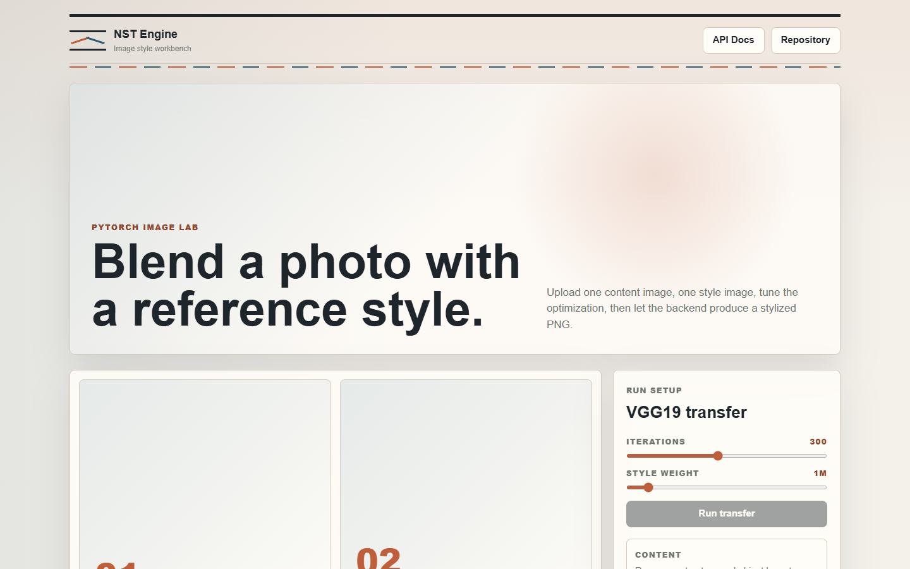

<!-- portfolio:start -->
<p align="center">
  
</p>

<h1 align="center">Neural Style Transfer API</h1>

<p align="center"><strong>A FastAPI and VGG19 image engine with a gallery-like frontend for artistic transformation.</strong></p>

<p align="center">

  
  
</p>

## Atelier Mood

This repo is presented like a digital art studio: image in, style in, generated result out.

## Core Pipeline

FastAPI handles uploads and orchestration while the model path performs neural style transfer with a web client on top.

## Run The Engine

`pip install -r requirements.txt` then run the API from `server.py` or the app package.

## Portfolio Note

This repository has its own visual identity inside the portfolio. The goal is that every project feels like a different product, not another copy of the same template.
<!-- portfolio:end -->

---

## Existing Project Notes

# Neural Style Transfer API

A FastAPI and PyTorch project for applying neural style transfer to images. The app includes a focused web workbench and a documented API for submitting style transfer jobs, checking status, and downloading results.



## What It Does

- Accepts a content image and a style reference image.
- Runs a VGG19-based neural style transfer pipeline.
- Uses content loss, Gram matrix style loss, and L-BFGS optimization.
- Processes jobs asynchronously so requests return quickly.
- Serves a clean browser workbench for local testing.
- Exposes API documentation through Swagger UI.

## Project Structure

```text
neural-style-transfer-api/
  app/
    core/
      config.py
      validators.py
    routers/
      health.py
      style.py
    services/
      style_transfer.py
    main.py
  frontend/
    index.html
    style.css
    app.js
  server.py
  Dockerfile
  requirements.txt
```

## API

| Method | Endpoint | Description |
|--------|----------|-------------|
| GET | `/health` | Service health and CUDA status |
| POST | `/style/transfer` | Submit a style transfer job |
| GET | `/style/status/{job_id}` | Check job status |
| GET | `/style/result/{job_id}` | Download the stylized PNG |
| GET | `/docs` | Swagger UI |

## Setup

```bash
python -m venv venv
venv\Scripts\activate
pip install -r requirements.txt
python server.py
```

Open:

```text
http://localhost:8000
```

## Configuration

Environment variables can be placed in `.env`.

| Variable | Default | Description |
|----------|---------|-------------|
| `HOST` | `0.0.0.0` | Server bind address |
| `PORT` | `8000` | Server port |
| `UPLOAD_DIR` | `uploads` | Uploaded image folder |
| `OUTPUT_DIR` | `outputs` | Generated result folder |
| `STYLE_ITERATIONS` | `300` | Optimization iterations |
| `STYLE_WEIGHT` | `1000000` | Style loss weight |
| `CONTENT_WEIGHT` | `1` | Content loss weight |
| `MAX_IMAGE_SIZE_MB` | `10` | Upload size limit |

## Docker

```bash
docker build -t nst-api .
docker run -p 8000:8000 nst-api
```

## Notes

The first run may download VGG19 weights. CPU execution works but can take several minutes depending on image size and iteration count.

## Author

Alfredo Oliva
